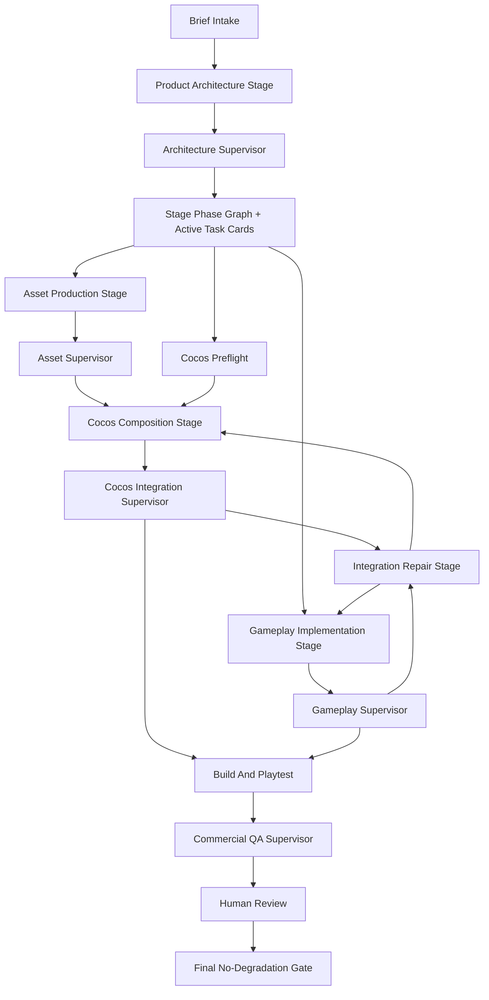

# Commercial Game Production V2 Pipeline Design

## Status

本文件是“零降级商业小游戏生产线 v2”的细化设计稿，用来回答三个问题：

- 每个 stage 内部如何继续拆 phase，而不是把 stage 直接等同于 task card。
- 架构、资产、Cocos Editor 组合、玩法实现、QA、supervisor 和人工验收如何在同一张可审计 graph 里协作。
- 自动并行、串行降级、repair loop、最终 GO/NO-GO 如何由 workflow 证据驱动，而不是由 scaffold 或 feature flag 冒充。

执行口径：后续落地时必须先打开新的 active phase，再由 workflow 生成 DB-backed task cards。本文不创建 M110 task cards，不宣称商业本体完成，也不允许任何 CLI-only、filesystem-only、event-only 或 scaffold-only 证据通过商业 GO。

This document is a design blueprint for the next `commercial_game_production` optimization. It is not an active task-card export and it does not create M110 task cards. Actual implementation must still open an active phase first, run `plan-graph`, `policy-preview`, and `goal-packet`, then materialize DB-backed task cards only for that active phase.

Current local Cocos ecosystem truth:

- Local Cocos Creator path: `C:\ProgramData\cocos\editors\Creator\3.8.8\CocosCreator.exe`.
- Local Editor bridge smoke `cocos_bridge_smoke_20260429_145028` passed `ecosystem_integration_go=true`.
- Verified bridge surface: Editor version, project open, AssetDB import/query, Scene open/execute/save, node/component binding, Prefab instantiate, Build hook report, and license/cost manifest.
- Cocos Store, paid assets, ads, IAP, analytics SDKs, and marketplace licensing remain out of scope until explicitly approved.
- Commercial game body is still not complete. This design must not be read as `commercial_playable_go=true`.

## Problem

The current production pipeline is too close to:

```text
pipeline stage -> DB task cards -> worker
```

That shape is enough for technical smoke and bounded repairs, but not enough for full commercial game generation. A commercial Cocos game needs architecture, multimodal assets, Cocos Editor composition, gameplay implementation, integration review, repair loops, build/playtest evidence, and human player review. These cannot be safely represented as a flat list of stage-level cards.

The target shape is:

```text
Pipeline
  -> Stage
    -> Stage-internal phase graph
      -> DB task cards
        -> specialized worker
          -> supervisor checkpoint
            -> repair or next phase
```

## Design Principles

- Workflow remains the control plane: receipt, lease, write_set, task-card authority, policy preview, evidence, heartbeat, and final gate.
- Cocos is a production surface, not just a final build tool.
- Business implementation must run through DB-backed task cards and workflow-controlled execution.
- Codex direct edits remain limited to workflow infrastructure bug-first repairs.
- No fallback may be packaged as success. Missing provider proof, missing bridge evidence, missing human review, failed build, or missing product depth must produce `blocked`, `failed`, `NO-GO`, or `AWAITING_HUMAN_REVIEW`.
- Task cards are generated from stage-internal phases, not directly from top-level pipeline stages.
- Graph generation may be automated, but graph preview and policy preview must be inspectable before execution.

## Architecture Layers

```text
Workflow Control Plane
  receipt / lease / write_set / task card / evidence / heartbeat / policy

Pipeline Template Layer
  commercial_game_production_v2

Stage Phase Graph Layer
  per-stage internal phases, dependencies, parallel groups, supervisor gates

Execution Layer
  asset worker / Cocos bridge worker / code patch worker / QA worker

Supervisor Layer
  architecture / asset / Cocos integration / gameplay / commercial QA / final gate

Validation Layer
  Cocos build / HTTP playtest / screenshots / audio runtime / human review
```

## Core Data Contracts

### Stage Phase

Each top-level stage owns an internal phase graph. A stage phase is not the same thing as a roadmap milestone phase.

Required fields:

```json
{
  "stage_id": "cocos_composition",
  "stage_phase_id": "prefab_authoring",
  "goal": "Create and instantiate gameplay prefabs through the Cocos Editor bridge.",
  "depends_on": ["assetdb_import", "scene_create_or_open"],
  "parallel_group": "cocos_serial",
  "worker_type": "cocos_prefab_worker",
  "write_set_policy": "exclusive",
  "supervisor_gate": "cocos_integration_supervisor",
  "evidence_requirements": ["prefab_create", "prefab_instantiate", "component_binding"],
  "blocking_conditions": ["filesystem_only_prefab", "missing_editor_api_report"]
}
```

### Task Card

Task cards are materialized from active stage phases only. They must include:

- `stage_id`
- `stage_phase_id`
- `task_card_id`
- `worker_type`
- `write_set`
- `read_set`
- `depends_on`
- `parallel_group`
- `test_commands`
- `acceptance_criteria`
- `evidence_requirements`
- `blocking_conditions`
- `risk_level`
- `model_guidance`
- `expected_artifacts`

### Asset Graph

Every generated or imported asset must be registered before Cocos import:

```json
{
  "asset_id": "skin_bamboo_01",
  "modality": "image|sprite|ui|sfx|bgm|voice|json|font|config",
  "provider": "minimax|gcp_tts|local_procedural|operator_supplied",
  "artifact_path": "state/.../skin_bamboo_01.png",
  "mime": "image/png",
  "sha256": "...",
  "license": "local_generated|operator_supplied|approved_commercial",
  "commercial_use_ok": true,
  "qa": {
    "usable": true,
    "non_empty": true,
    "rms": null,
    "peak": null,
    "duration_seconds": null,
    "visual_diff_ok": true,
    "clipping": false
  }
}
```

### Cocos Bridge Ledger

The Cocos bridge worker appends every Editor operation:

```json
{
  "operation_id": "scene_save_001",
  "stage_phase_id": "scene_save",
  "api_channel": "Editor.Message.request(scene, save-scene)",
  "input_summary": {},
  "output_summary": {},
  "status": "completed|failed|blocked",
  "failure_class": null,
  "artifact_path": "state/.../cocos_editor_bridge_report.json"
}
```

### Same-project Patch Ledger

Code workers append one entry per task card:

```json
{
  "task_card_id": "gameplay_level_system_001",
  "receipt_id": "...",
  "child_run_id": "...",
  "write_set": ["state/.../cocos_project/assets/scripts"],
  "changed_files": ["..."],
  "patch_hash": "...",
  "mutation_result": "applied",
  "test_status": "passed|failed|blocked",
  "failure_class": null
}
```

## Pipeline Stages And Internal Phases

### Stage 0: Preflight And Truth

Purpose: stop early if workflow or provider infrastructure cannot support the run.

Internal phases:

| Phase | Worker | Must Be Serial | Output |
| --- | --- | --- | --- |
| `receipt_lease_preflight` | workflow control plane | yes | receipt/lease validation evidence |
| `provider_capability_check` | capability probe worker | no | provider live-proof report |
| `cocos_editor_bridge_check` | Cocos bridge runner | yes | bridge evidence or operator action |
| `policy_preview` | policy preview worker | yes | policy preview |
| `operator_packet` | operator packet worker | yes | run packet |

Hard blockers:

- Missing receipt/lease for high-risk execution.
- Cocos bridge failure when `--require-cocos-ecosystem` is enabled.
- Provider-specific live proof missing when live roles or real assets are required.
- Existing user-owned Cocos process blocks the target project and operator has not allowed reuse.

### Stage 1: Product Architecture

Purpose: produce a coherent game architecture before generating assets or code.

Internal phases:

| Phase | Worker | Parallelism | Output |
| --- | --- | --- | --- |
| `brief_normalization` | intake worker | serial | unified project brief |
| `gameplay_architecture` | gameplay role | parallel | core loop and level model |
| `system_architecture` | tech role | parallel | runtime/module plan |
| `asset_architecture` | asset role | parallel | asset requirements |
| `cocos_scene_prefab_architecture` | Cocos role | parallel | scene/prefab plan |
| `monetization_retention_architecture` | product role | parallel | shop/reward/collection plan |
| `architecture_supervisor_gate` | supervisor | serial | architecture approval or repair |

Required artifacts:

- `game_architecture_spec.json`
- `stage_phase_graph_seed.json`
- `asset_requirement_spec.json`
- `scene_prefab_plan.json`
- `commercial_acceptance_spec.json`

Supervisor checks:

- Does the design include a real playable loop?
- Are at least 8 distinct level goals specified?
- Are shop/skin/collection/economy requirements player-visible?
- Are assets mapped to runtime use, not just listed?
- Are Cocos Scene/Prefab responsibilities explicit?

### Stage 2: Asset Production

Purpose: generate, QA, license-check, and freeze assets before Cocos composition.

Internal phases:

| Phase | Worker | Parallelism | Output |
| --- | --- | --- | --- |
| `asset_requirement_normalization` | asset planner | serial | normalized asset requirements |
| `image_sprite_ui_generation` | asset provider worker | parallel | images/sprites/UI assets |
| `sfx_generation` | procedural/audio worker | parallel | short SFX with QA |
| `bgm_generation` | music provider worker | parallel | BGM artifact |
| `voice_generation` | voice/TTS worker | parallel | voice clips, if required |
| `font_config_json_generation` | local worker | parallel | fonts/config/data |
| `asset_qa` | asset QA worker | parallel | QA report |
| `license_cost_manifest` | governance worker | serial | license/cost manifest |
| `asset_graph_freeze` | asset supervisor | serial | frozen asset graph |
| `asset_supervisor_gate` | supervisor | serial | GO/NO-GO |

Hard blockers:

- Asset missing artifact path, mime, sha256, provider, or provenance.
- SFX without duration/RMS/peak/non-silent/clipping QA.
- BGM or voice marked successful without runtime-compatible artifact.
- Paid or marketplace asset imported without operator approval.
- Placeholder-only asset graph when real assets are required.

### Stage 3: Cocos Composition

Purpose: use the Cocos Editor ecosystem to assemble imported assets into real project structure.

Internal phases:

| Phase | Worker | Must Be Serial | Output |
| --- | --- | --- | --- |
| `editor_bridge_preflight` | Cocos bridge worker | yes | Editor bridge ready |
| `assetdb_import` | Cocos AssetDB worker | mostly serial | imported assets |
| `assetdb_query_verify` | Cocos AssetDB worker | no | query evidence |
| `scene_create_or_open` | Cocos scene worker | yes | scene evidence |
| `prefab_create` | Cocos prefab worker | yes per prefab group | prefab evidence |
| `prefab_instantiate` | Cocos prefab worker | yes per scene | scene instances |
| `node_component_binding` | Cocos scene worker | yes per scene | component binding |
| `ui_audio_asset_binding` | Cocos bridge worker | yes per scene | UI/audio binding |
| `scene_save` | Cocos scene worker | yes | saved scene |
| `build_hook_probe` | Cocos build worker | yes | build hook evidence |
| `cocos_integration_supervisor_gate` | supervisor | yes | GO/repair |

Hard blockers:

- Filesystem writes pretending to be AssetDB import.
- CLI build pretending to be Editor bridge evidence.
- Scene/Prefab operations missing Editor API report.
- Asset graph assets not visible in AssetDB query.
- UI/audio binding exists only as labels, not runtime references.

### Stage 4: Gameplay Implementation

Purpose: implement the actual commercial game body in the same Cocos project.

Internal phases:

| Phase | Worker | Parallelism | Output |
| --- | --- | --- | --- |
| `core_loop_code` | code patch worker | serial base | loop implementation |
| `level_system` | code patch worker | serial with core | level progression |
| `eight_distinct_level_goals` | code patch worker | serial | 8 level goals |
| `reward_economy` | code patch worker | can parallel after core | coins/rewards |
| `shop_skin_collection` | code patch worker | can parallel after economy | shop/skins/collection |
| `audio_runtime` | code patch worker | can parallel after asset binding | BGM/SFX controls |
| `animation_feedback` | code patch worker | can parallel after core | visual feedback |
| `save_progress` | code patch worker | can parallel after economy | persistence |
| `gameplay_supervisor_gate` | supervisor | serial | GO/repair |

Execution rules:

- Use `workflowctl run from-task-card --execute`.
- Default patch apply route is Codex CLI enforcement.
- OpenCode remains simple lane only and must not be default patch apply for complex game mutation.
- All changes patch the same Cocos project.
- Re-running a scaffold is a blocker.

### Stage 5: Integration Repair

Purpose: repair only the failing slices of the same project.

Internal phases:

| Phase | Worker | Output |
| --- | --- | --- |
| `integration_diff_review` | supervisor | failing surface map |
| `broken_binding_detection` | QA/bridge worker | missing binding report |
| `missing_feature_detection` | QA worker | feature gap report |
| `supervisor_repair_packet_generation` | supervisor | repair packets |
| `same_project_repair_execution` | code/Cocos worker | repair ledger |
| `regression_check` | validation worker | pass/fail evidence |

Repair packet contract:

```json
{
  "repair_packet_id": "...",
  "target_stage": "cocos_composition|gameplay_implementation|asset_production",
  "target_stage_phase": "...",
  "failure_class": "...",
  "write_set": ["..."],
  "read_set": ["..."],
  "repair_prompt": "...",
  "rerun_tests": ["..."],
  "must_patch_same_project": true
}
```

### Stage 6: Build And Playtest

Purpose: prove the game can build and run in a browser with player-visible evidence.

Internal phases:

| Phase | Worker | Output |
| --- | --- | --- |
| `cocos_build_api` | Cocos build worker | build evidence |
| `build_artifact_verify` | artifact worker | artifact checks |
| `http_server_start` | runtime worker | server evidence |
| `browser_playtest` | playtest worker | browser event evidence |
| `screenshot_capture` | playtest worker | screenshots |
| `console_audio_error_scan` | playtest worker | runtime errors |
| `feature_coverage_probe` | QA worker | feature coverage |

Hard blockers:

- Cocos build nonzero exit unless explicitly classified nonfatal by a trusted build report.
- Fatal build markers in stdout/stderr.
- `NotSupportedError`, media decode failure, audio play failure, or browser runtime crash.
- Canvas non-empty without feature proof.

### Stage 7: Commercial QA And Human Review

Purpose: decide commercial readiness without downgrade.

Internal phases:

| Phase | Worker | Output |
| --- | --- | --- |
| `commercial_feature_gate` | QA supervisor | feature gate |
| `player_visible_review` | QA worker | screenshots/player notes |
| `qa_supervisor_repair` | supervisor | repair or pass |
| `human_player_review` | operator/human | review packet |
| `final_no_degradation_gate` | final supervisor | GO/NO-GO |

Final GO requires:

- Cocos ecosystem bridge GO.
- Asset graph GO.
- Same-project patch GO.
- 8 distinct level goals.
- Real win/fail/reward loop.
- Shop with owned/unowned/equipped states.
- Skin equip produces visible screenshot difference.
- Collection/gallery is navigable and backed by data.
- BGM started.
- SFX runtime play promise succeeds.
- Volume toggle works.
- Cocos build and HTTP browser playtest pass.
- Player-visible screenshots exist.
- Human review is accepted.

If human review is missing, final status is `AWAITING_HUMAN_REVIEW`, not GO.

## Supervisor Design

Supervisors are active control nodes, not summaries.

| Supervisor | Scope | Main Decision |
| --- | --- | --- |
| `ArchitectureSupervisor` | Stage 1 | approve design or request architecture repair |
| `AssetSupervisor` | Stage 2 | approve asset graph or block bad assets |
| `CocosIntegrationSupervisor` | Stage 3 | approve Editor composition or issue bridge repair |
| `GameplaySupervisor` | Stage 4 | approve game logic integration or issue code repair |
| `CommercialQASupervisor` | Stages 5-7 | judge player-visible commercial quality |
| `NoDegradationSupervisor` | final | GO, NO-GO, blocked, or awaiting human review |

Supervisor outputs must include:

- `go_no_go`
- `failure_class`
- `findings`
- `repair_packets`
- `evidence_paths`
- `recoverable_suggestions`
- `next_allowed_actions`

## Graph Planning

The graph planner may generate stage-internal DAGs automatically, but only from explicit inputs:

- pipeline template
- role outputs
- stage phase templates
- task-card write_set/read_set
- asset graph
- Cocos bridge capability state
- policy constraints

Required graph outputs before execution:

- `stage_phase_graph.json`
- `parallel_groups.json`
- `write_set_conflicts.json`
- `policy_preview.json`
- `operator_packet.json`

The graph may not execute directly. Execution still goes through workflow receipts, leases, DB task cards, workers, and evidence.

## Parallelism Rules

Allowed parallelism:

- Role specs after brief normalization.
- Independent asset generation.
- Independent asset QA.
- Independent non-overlapping code patches after core loop stabilizes.
- Documentation and manifest validation.

Required serial execution:

- Receipt/lease preflight.
- Cocos bridge preflight.
- Same Scene write operations.
- Same Prefab write operations.
- Same write_set code patch.
- Build/playtest/final gate.

Default limits:

- `max_workers=2`.
- Any write_set conflict downgrades to serial.
- SQLite lock, receipt mismatch, repo mutation error, route failure, or bridge process conflict triggers bug-first handling.

## Worker Types

| Worker | Responsibility | Forbidden Substitute |
| --- | --- | --- |
| `asset_provider_worker` | Generate artifacts through approved provider/local generator | text-only asset claim |
| `asset_qa_worker` | Validate mime/hash/quality/license | feature flag only |
| `cocos_assetdb_worker` | AssetDB import/query through Editor bridge | filesystem copy as proof |
| `cocos_scene_worker` | scene open/execute/save through Editor bridge | static JSON as proof |
| `cocos_prefab_worker` | prefab create/instantiate through Editor bridge | label-only prefab |
| `cocos_build_worker` | build hook/build API evidence | CLI-only success as ecosystem proof |
| `code_patch_worker` | gameplay/economy/UI/audio code patch | scaffold regeneration |
| `qa_playtest_worker` | browser/screenshot/audio runtime evidence | canvas non-empty only |

## Evidence Matrix

| Area | Required Evidence |
| --- | --- |
| Workflow | plan graph, policy preview, goal packet, receipt/lease, task-card DB rows |
| Assets | asset graph, artifact path, mime, sha256, provider proof, QA, license/cost |
| Cocos | Editor bridge report, AssetDB import/query, Scene save, Prefab instantiate, Build hook |
| Code | same-project patch ledger, mutation result, changed files, test results |
| Runtime | Cocos build, HTTP server, browser playtest, screenshots, console/audio errors |
| Commercial | feature coverage, player-visible review, human review, final no-degradation gate |

## Failure Classes

Common failure classes should be stable:

- `receipt_scope_mismatch`
- `automation_lease_missing`
- `provider_live_proof_missing`
- `asset_provider_failed`
- `asset_qa_failed`
- `cocos_editor_operator_action_required`
- `cocos_ecosystem_bridge_missing`
- `cocos_assetdb_import_failed`
- `cocos_scene_save_failed`
- `cocos_prefab_instantiate_failed`
- `same_project_patch_failed`
- `provider_idle_timeout`
- `repo_mutation_failed`
- `cocos_build_nonzero_exit`
- `browser_or_audio_runtime_error`
- `commercial_feature_depth_missing`
- `awaiting_human_player_review`

## Mermaid Overview



## Implementation Sequence

Implementation should be phased, but only the active phase should materialize DB task cards.

1. Add stage-internal phase graph contracts and preview output.
2. Teach `commercial_game_production` to materialize task cards from stage phases.
3. Split worker types: asset, Cocos bridge, code patch, QA, supervisor.
4. Add supervisor checkpoint outputs and repair packet routing.
5. Add asset graph freeze and Cocos bridge ledger consumption.
6. Tighten final gate to consume asset graph, Cocos ledger, patch ledger, runtime evidence, and human review.
7. Run a strict commercial game production attempt only after the above gates pass.

## Non-goals

- Do not revive `commercial_cocos_game`.
- Do not make CLI build or browser playtest stand in for Editor ecosystem evidence.
- Do not import Cocos Store or paid assets without explicit operator approval.
- Do not let Codex directly hand-edit commercial game body outside workflow task-card execution.
- Do not mark human-review-missing runs as commercial GO.
