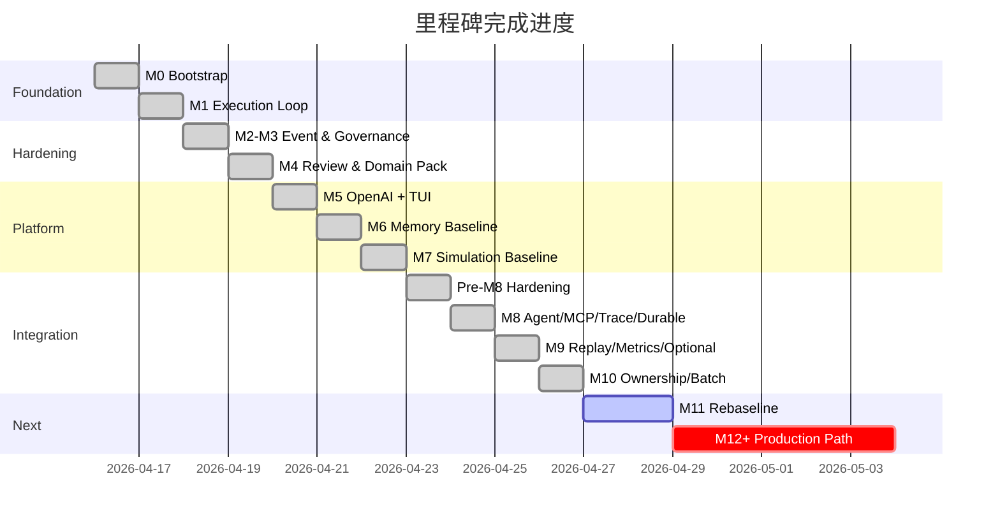

# Universal Agentic Workflow OS — 当前版本深度评估 & 完成路径规划

**评估人：** Claude Opus 4.6 (Thinking)  
**评估日期：** 2026-04-20  
**评估基线：** M10 Freeze (`ed31593`) | 237 tests passed ✅ | Offline Validation passed ✅

---

## 一、当前版本全景评估

### 1.1 已交付能力矩阵

| 能力层 | 已交付 | 成熟度 |
|-------|--------|--------|
| **Run Lifecycle** | create → compile → resume → approve/reject → cancel + recompile | ⭐⭐⭐⭐⭐ |
| **Review Policy** | 5 策略 (auto_only / optional / recommended / human_required / mandatory) | ⭐⭐⭐⭐⭐ |
| **Execution Adapters** | Shell / OpenCode / Noop / LangChain Agent (flag-gated) | ⭐⭐⭐⭐☆ |
| **Capability Plane** | CapabilityRegistry + ToolProjectionManifest + MCP Source (flag-gated) | ⭐⭐⭐⭐☆ |
| **Domain Packs** | 平台化 seed-backed 体系 + resolve + validate + export-skill | ⭐⭐⭐⭐☆ |
| **Memory** | Namespace catalog + candidate → item materialization + retrieval preview + compile-time injection | ⭐⭐⭐⭐☆ |
| **Simulation** | Policy registry + deterministic runner + lifecycle hooks + persisted records | ⭐⭐⭐⭐☆ |
| **Governance** | Tech-debt / review-policy / metrics / alerts / release-readiness / domain-pack reports | ⭐⭐⭐⭐⭐ |
| **Observability** | OTel-first TraceExporter + NullTraceExporter + Langfuse sink (opt-in) | ⭐⭐⭐☆☆ |
| **Durable Pilot** | DurableRuntimePilot abstraction + NullPilot + env-driven builder (flag-gated) | ⭐⭐⭐☆☆ |
| **Ownership / Claims** | Claim + Worker-Lease + Ownership Topology + batch-domain lineage | ⭐⭐⭐⭐⭐ |
| **Batch Concurrency** | Local batch-barrier events + parallel-batch resume (CLI + API) | ⭐⭐⭐⭐☆ |
| **Runtime Gateway** | OpenAI-backed opt-in live provider + NullGateway default | ⭐⭐⭐⭐☆ |
| **Operator Surfaces** | CLI (28+ commands) + API (30+ routes) + TUI dashboard | ⭐⭐⭐⭐⭐ |
| **Audit & Replay** | audit-report + replay-packet + event-inspection + run-metrics | ⭐⭐⭐⭐⭐ |

### 1.2 代码规模度量

```
┌─────────────────────────┬────────────┬────────────┐
│ 层                       │ 文件数      │ 总行数      │
├─────────────────────────┼────────────┼────────────┤
│ packages/contracts       │ 4 files    │ ~1,344     │
│ packages/core_domain     │ 24 files   │ ~8,396     │
│ packages/runtime_langgraph│ 2 files   │ ~275       │
│ packages/worker_adapters │ 9 files    │ ~575       │
│ apps (CLI + API + TUI)   │ 3 files    │ ~1,027     │
│ tests                   │ 9 files    │ ~5,611     │
├─────────────────────────┼────────────┼────────────┤
│ 总计                     │ 51 files   │ ~17,228    │
└─────────────────────────┴────────────┴────────────┘
```

### 1.3 架构健康度诊断

#### ✅ 强项

1. **本地优先 (Local-First) 原则贯彻彻底** — SQLite 作为唯一持久层，所有外部依赖均为 opt-in
2. **生命周期语义完整** — 从 pending → prepared → running → review → terminal 的状态机覆盖完善
3. **Contract-first 设计** — Pydantic BaseModel 驱动的契约层干净且一致
4. **测试置信度高** — 237 项测试覆盖了 lifecycle、CLI、API、governance、repositories、contracts 全栈
5. **文档治理严谨** — freeze review → phase review → tech-debt registry → development workflow 四层文档链完整
6. **Feature Flag 纪律** — 所有 M8 外部能力通过 5 个环境变量开关完全隔离

#### 🟡 需关注

1. **`services.py` 仍是 2,153 行的巨型文件** — 虽已提取了 `LifecycleServiceMixin` (1,334行)、`ProjectionServiceMixin` (929行)、`MemorySimulationServiceMixin` (370行)，但 `OrchestratorService` 仍然是所有逻辑的唯一入口门面
2. **`repositories.py` 1,124 行** — 14 个 Repository 类全在一个文件中
3. **真正的外部集成验证仍薄** — Agent Lane / MCP Source / Durable Pilot 虽然抽象已就位，但实际集成深度停留在 stub/mock 层
4. **测试中缺少 disable-path 专项覆盖** — `test_pre_m8_hardening.py` (29行) 和 `test_release_closeout.py` (25行) 体量偏小
5. **`governance.py` 696 行** — 治理报告生成逻辑持续膨胀

#### ⚠️ 结构性风险

1. **单一 God Object 瓶颈** — `OrchestratorService` + 3 个 Mixin 合计约 4,786 行，所有操作都通过它 dispatch。这在当前规模还可接受，但进入 M11+ 后会成为并行开发和测试的瓶颈。
2. **TD-019 远程化债务** — 真正的外部 worker pool / 多节点调度仍未触及，如果终极目标是分布式运行，这个债务会持续累积。

---

## 二、里程碑完成度回溯



### 关键数据

| 指标 | 数值 |
|------|------|
| Git commits | 9 |
| 已完成里程碑 | M0 → M10 (11 个) |
| 已偿还技术债 | TD-001 ~ TD-018 (18 项) |
| 未偿还技术债 | TD-019 (1 项) |
| 测试数 | 237 |
| API 路由数 | 30+ |
| CLI 命令数 | 28+ |
| Preset 数 | 5 (feature_delivery, optional_delivery, advisory_delivery, guarded_delivery, research_spike) |

---

## 三、"彻底完成" 的定义 — 三个完成级别

> [!IMPORTANT]
> 在给出路径建议前，需先对齐 "完成" 的含义。以下三个级别适用于不同的产品目标。

### Level A：本地单机可用产品 (Local-First MVP)

> 一个人在本地机器上，通过 CLI/API 驱动全部工作流，无需外部服务。

**当前完成度：~85%**  
主要缺口：端到端用户文档 / 安装体验 / error recovery UX

### Level B：本地增强可用产品 (Local + External Enhance)

> Level A + 可选的 LLM 执行、MCP 工具调用、外部可观测性。

**当前完成度：~60%**  
主要缺口：Agent Lane 端到端验证 / MCP 真实集成 / Trace 真实导出 / Durable Pilot 真实 checkpoint

### Level C：多节点分布式运行时 (Distributed Runtime)

> Level B + 远程 Worker Pool / 分布式 Lease / 调度共识。

**当前完成度：~15%**  
主要缺口：TD-019 全部内容

---

## 四、推荐完成路径规划

> [!TIP]
> 建议优先完成 **Level B**，将 Level C 作为长期方向而非近期目标。以下路径规划基于 Level B 目标。

### Phase Map 总览

```
M11 ─── Phase 0: Post-M10 Rebaseline & Scope Freeze
   │    ├── 基线重新评估
   │    ├── M11 scope 冻结 (Level B 定位)
   │    └── OrchestratorService 拆分方案冻结
   │
   ├── Phase 1: Service Decomposition
   │    ├── repositories.py → 按域拆分
   │    ├── OrchestratorService → 领域服务组 (非 Mixin)
   │    └── 服务间依赖注入整理
   │
   ├── Phase 2: Agent Lane End-to-End
   │    ├── LangChain Agent 真实执行验证
   │    ├── Agent ↔ Repository State 双写一致性
   │    └── disable-path + fallback 专项测试
   │
   ├── Phase 3: MCP Integration Hardening
   │    ├── 真实 local stdio MCP server 集成
   │    ├── ToolProjection → Agent 注入验证
   │    └── MCP 超时/降级/schema budget 端到端
   │
   └── Phase 4: M11 Freeze Review

M12 ─── Phase 0: Post-M11 Rebaseline
   │
   ├── Phase 1: Durable Pilot End-to-End
   │    ├── LangGraph Functional API 真实 checkpoint
   │    ├── pause/resume/HITL 端到端
   │    └── Kill Criteria 验证
   │
   ├── Phase 2: Observability Hardening
   │    ├── Langfuse sink 真实接通
   │    ├── Trace correlation 端到端
   │    └── sink-down 隔离验证
   │
   ├── Phase 3: User Experience & Documentation
   │    ├── 安装引导 / Quick Start 文档
   │    ├── Error message 人性化
   │    ├── CLI help 完善
   │    └── 一键 demo 场景脚本
   │
   └── Phase 4: M12 Freeze Review

M13 ─── Confidence & Stabilization
   │
   ├── Phase 1: 端到端测试体系升级
   │    ├── 集成测试 (含真实外部服务 mock)
   │    ├── property-based testing (契约层)
   │    ├── disable-path 全量覆盖
   │    └── 性能基线 benchmark
   │
   ├── Phase 2: Production Readiness
   │    ├── 配置管理 (config file, not just env vars)
   │    ├── 日志体系标准化
   │    ├── 错误分类体系 (error taxonomy)
   │    └── pyproject.toml 版本管理 + CHANGELOG
   │
   └── Phase 3: M13 Freeze → Level B Complete ✅
```

---

## 五、各阶段关键技术决策点

### M11 关键决策

| # | 决策点 | 推荐选择 | 理由 |
|---|--------|----------|------|
| 1 | OrchestratorService 拆分策略 | **领域服务组 (Domain Service Group)** 而非继续 Mixin | Mixin 在 ~5,000 行时已失去封装意义，应拆为 `LifecycleService` / `ProjectionService` / `MemoryService` / `SimulationService` / `GovernanceService`，共享 repository 层 |
| 2 | repositories.py 拆分 | **按持久化域拆分** (run_repos.py / claim_repos.py / memory_repos.py 等) | 当前 14 个类 1,124 行在一个文件，PR review 效率低 |
| 3 | Agent Lane 真实性验证 | **先做一个最小 research_spike 全流程** | 不要继续停留在抽象层。真实调一次 `create_agent`，拿到真实 tool 调用结果，走一遍完整 lifecycle |
| 4 | MCP 真实集成 | **先造一个 minimal local stdio MCP server 用于测试** | 在 `tests/` 或 `infra/` 中放一个 trivial MCP server，验证 stdio 通路全链路 |

### M12 关键决策

| # | 决策点 | 推荐选择 | 理由 |
|---|--------|----------|------|
| 1 | Durable Pilot 存废 | **基于 M11 Agent Lane 的真实执行结果决定** | 如果 Agent Lane 证明 LangChain 的 checkpoint 已足够，Durable Pilot 可以降级为 "nice-to-have" |
| 2 | Observability 深度 | **只做 Langfuse 一个 sink，不做 LangSmith** | 在 Level B 阶段不需要双 sink |
| 3 | 配置管理 | **引入 TOML 配置文件 + env override** | 当前 ~15 个环境变量驱动已触及管理上限 |

---

## 六、风险矩阵与缓解策略

| 风险 | 概率 | 影响 | 缓解 |
|------|------|------|------|
| Agent Lane 真实集成时发现 LangChain API 版本不兼容 | 中 | 高 | `langchain>=1.0.0,<2.0.0` 范围过宽，需在 Phase 0 锁定精确版本 |
| OrchestratorService 拆分引发大量测试重写 | 高 | 中 | 采用渐进式拆分：先抽接口，再移实现，旧门面保持 API 兼容 |
| MCP stdio 在 Windows 上的子进程管理差异 | 中 | 中 | 已有 `subprocess_support.py` 基础，需补 Windows-specific 超时测试 |
| 217K+ 的 `state/*.db` 文件积累影响 Git 仓库大小 | 低 | 低 | 已在 `.gitignore` 中排除 state 目录 |
| Durable Pilot 因 LangGraph 依赖链过重而被 Kill | 中 | 低 | Kill Criteria 机制已在 M8 plan 中定义，kill 后不影响 Level A 能力 |

---

## 七、立即可执行的下一步 (Next 3 Actions)

> [!IMPORTANT]
> 以下三个动作是进入 M11 之前应立即执行的。

### Action 1: M11 Phase 0 — Rebaseline & Scope Freeze

**内容：**
- 读取 M10 freeze review
- 确认 Level B 作为 M11-M13 的产品目标
- 冻结 OrchestratorService 拆分方案 (ADR)
- 锁定 `langchain` / `langgraph` 精确可用版本
- 生成 M11 Phase 0 task-card pack

### Action 2: 锁定 LangChain 可用版本

**具体操作：**
```powershell
pip install "langchain>=1.0.0,<2.0.0" "langchain-openai>=1.0.0,<2.0.0"
python -c "import langchain; print(langchain.__version__)"
```
然后在 `pyproject.toml` 的 `[project.optional-dependencies].m8` 中锁定到实际可用的 minor 版本。

### Action 3: 验证 Agent Lane 最小可行路径

**具体操作：**
```powershell
$env:UAWO_ENABLE_AGENT_LANE="1"
$env:OPENAI_API_KEY="<your key>"
python -m apps.operator_cli.main --db-path state/agent_test.db db reset
python -m apps.operator_cli.main --db-path state/agent_test.db run create --goal "Test agent lane" --preset research_spike
# 然后 compile + resume，观察 Agent 是否真实执行
```

---

## 八、一句话总结

> **M10 完成了一个架构精良的本地控制平面骨架。从 M11 开始，工作重心应从 "正确抽象" 转向 "真实集成"——让 Agent Lane、MCP、Trace 三条通路从 stub 走向端到端可验证，同时将 OrchestratorService 从 God Object 拆分为可维护的领域服务组。预计 M11-M13 三个周期可达成 Level B (本地增强可用产品) 的完成基线。**
